## Pick-Place Robot
<!--<h4>Object picking and stowing with a 6-DOF KUKA KR210 <br>anthropomorphic articulated robotic manipulator<br>using ROS</h4>-->

<p align="center">
<b><i>Object picking and stowing with a 6-DOF KUKA KR210 anthropomorphic  robotic serial manipulator using ROS</i></b>
</p>

<p align="center">
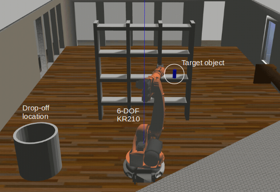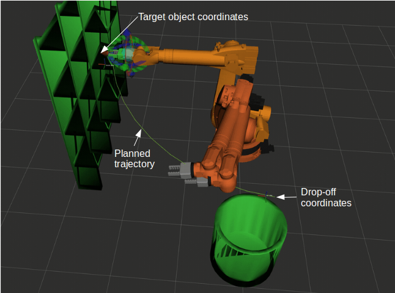
</p>

<p align="center">
<b>Salman Hashmi</b>
<br>
<a href="mailto:sah517@g.harvard.edu" target="_top">sah517@g.harvard.edu</a>
</p>

------------

<a id="top"></a>
### Contents
1. [Introduction](#1.0)
2. [Environment Setup](#2.0)
3. [Theoretical Background](#3.0)
4. [Design Requirements](#4.0)
5. [Design Implementation](#5.0)
7. [Testing and Review](#6.0)

------------

### Abbreviations

* **DOF** &nbsp;&nbsp;&nbsp;&nbsp;&nbsp; [Degrees Of Freedom](https://en.wikipedia.org/wiki/Degrees_of_freedom_(mechanics))
* **ROS** &nbsp;&nbsp;&nbsp;&nbsp;&nbsp; [Robot Operating System](http://www.ros.org/)
* **ARC** &nbsp;&nbsp;&nbsp;&nbsp;&nbsp; [Amazon Robotics Challenge](https://www.amazonrobotics.com/#/roboticschallenge)
* **ISS** &nbsp;&nbsp;&nbsp;&nbsp;&nbsp;&nbsp;&nbsp; [International Space Station](https://en.wikipedia.org/wiki/International_Space_Station)
* **EVA** &nbsp;&nbsp;&nbsp;&nbsp;&nbsp;&nbsp; [Extra Vehicular Activity](https://en.wikipedia.org/wiki/Extravehicular_activity)
* **EE** &nbsp;&nbsp;&nbsp;&nbsp;&nbsp;&nbsp;&nbsp;&nbsp; [End-Effector](https://en.wikipedia.org/wiki/Robot_end_effector)
* **WC** &nbsp;&nbsp;&nbsp;&nbsp;&nbsp;&nbsp;&nbsp; [Wrist Center](https://www.youtube.com/watch?v=V_6diIcQl0U)
* **DH** &nbsp;&nbsp;&nbsp;&nbsp;&nbsp;&nbsp;&nbsp;&nbsp;&nbsp;[Denavit–Hartenberg](https://en.wikipedia.org/wiki/Denavit%E2%80%93Hartenberg_parameters)
* **FK** &nbsp;&nbsp;&nbsp;&nbsp;&nbsp;&nbsp;&nbsp;&nbsp; [Forward Kinematics](https://en.wikipedia.org/wiki/Forward_kinematics)
* **IK** &nbsp;&nbsp;&nbsp;&nbsp;&nbsp;&nbsp;&nbsp;&nbsp;&nbsp; [Inverse Kinematics](https://en.wikipedia.org/wiki/Inverse_kinematics)
* **RRR** &nbsp;&nbsp;&nbsp;&nbsp;&nbsp; [Revolute Revolute Revolute](http://www.roboticsbible.com/robot-links-and-joints.html)
* **URDF** &nbsp;&nbsp;&nbsp; [Unified Robot Description Format](http://wiki.ros.org/urdf)

------------

<a name="1.0"></a>
### 1. Introduction
This project originated from Udacity's [Robotic arm - Pick & Place project](https://github.com/udacity/RoboND-Kinematics-Project), which, in turn is based on the [**Amazon** Robotics Challenge](https://www.amazonrobotics.com/#/roboticschallenge) sponsored by Amazon Robotics LLC.

<p align="center">
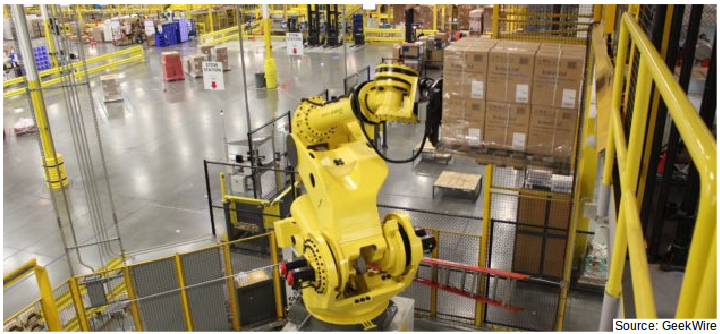
<br>
<sup><b>Fig. 1.1&nbsp;&nbsp;A robotic arm shelving products in an Amazon fulfillment center</b></sup>
</p>

##### Objective
Commercially viable automated picking and stowing in unstructured environments, like picking products off shelves and putting them into shipping boxes, still remains a difficult challenge. The goal of the ARC is to perform simplified versions of the general task of picking and stowing items on shelves. As per *ARC Rules*: "The Challenge combines object recognition, pose recognition, grasp planning, compliant manipulation, motion planning, task planning, task execution, and error detection and recovery". 

The objective of this project is to demonstrate autonomous capability of the KR210 [serial manipulator](https://en.wikipedia.org/wiki/Serial_manipulator) in simulation to *pick and place* an object in a semi-unstructured environment.

Within the context of this project, a single *pick and place* cycle can be divided into the following tasks:

* Identify the target object on the shelf
* Plan and perform a clean movement towards the object
* Efficiently grasp/pick the target object without disturbing other objects
* Plan and perform a clean movement towards the drop-off site
* Efficiently stow/place the object at the drop-off site

##### Relevance
The capability of picking and placing objects relies on being able to locate points of interest in a 3D environment and planning movement trajectories to those points. All robotic manipulators in industry depend on this capability. 

<p align="center">
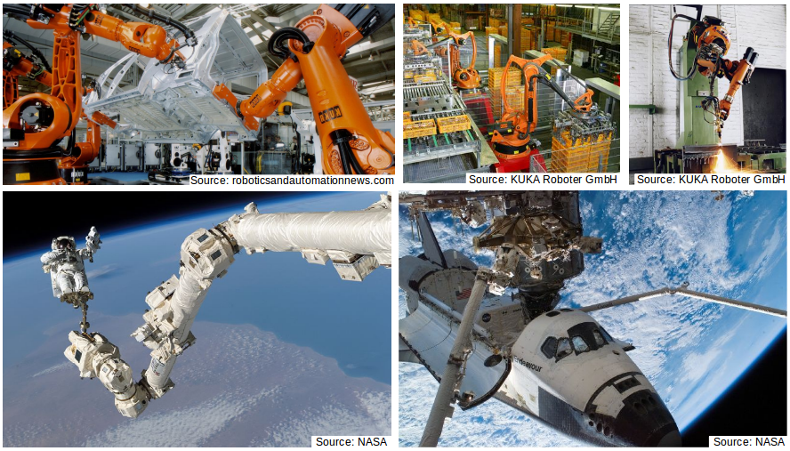
<br>
<sup><b>Fig. 1.2&nbsp;&nbsp;Robotic serial manipulators can be found in almost every industry</b></sup>
</p>

Robotic manipulators have become ubiquitous in almost every industry; from food, beverage, shipping and packaging to manufacturing, foundry and space:

* Palletizing food in a bakery
* Precision painting of automobiles and aircrafts
* Targeting products to their packaging stations in a warehouse
* Cutting steel and manufacturing of steel bridges
* Spot Welding and automating foundry processes
* Assisting in the deployment of satellites
* Docking and berthing of spacecrafts to the ISS
* Assisting in the mobility of astronauts during EVA

All of these jobs require the same core capability, namely, that of the robotic arm's end-effector to reach specific 3D coordinates within its workspace so that it can interact with the environment at that location, as this project aims to demonstrate.

------------

<a name="2.0"></a>
<!--<div style="text-align:left;">
  <span style="font-size: 1.4em; margin-top: 0.83em; margin-bottom: 0.83em; margin-left: 0; margin-right: 0; font-weight: bold;"> 2. Environment Setup</span><span style="float:right;"><a href="#top">Back to Top</a></span>
</div>-->
### 2. Environment Setup
The project uses [ROS Kinetic Kame](http://wiki.ros.org/kinetic) running on [Ubuntu 16.04 LTS (Xenial Xerus)](http://releases.ubuntu.com/16.04/).

The following tools are used for simulation and motion planning:

* [Gazebo](http://gazebosim.org/): a physics based 3D simulator extensively used in the robotics world
* [RViz](http://wiki.ros.org/rviz): a 3D visualizer for sensor data analysis, and robot state visualization
* [MoveIt!](http://moveit.ros.org/): a ROS based software framework for motion planning, kinematics and robot control

Once ROS is installed, we can proceed with the environment setup for the project:

##### Verify Project Tools

1\. Verify the version of gazebo installed with ROS
```sh
$ gazebo --version
```
2\. If the installed gazebo version is not 7.7.0+, update it as follows
```sh
$ sudo sh -c 'echo "deb http://packages.osrfoundation.org/gazebo/ubuntu-stable `lsb_release -cs` main" > /etc/apt/sources.list.d/gazebo-stable.list'
$ wget http://packages.osrfoundation.org/gazebo.key -O - | sudo apt-key add -
$ sudo apt-get update
$ sudo apt-get install gazebo7
```

##### Create ROS Workspace
3\. Create a [catkin](http://wiki.ros.org/catkin/conceptual_overview) workspace if haven't already
```sh
$ mkdir -p ~/catkin_ws/src
$ cd ~/catkin_ws/
$ catkin_init_workspace
$ ls -l
```
Notice that a symbolic link (CMakeLists.txt) has been created to `/opt/ros/kinetic/share/catkin/cmake/toplevel.cmake`

4\. Clone or download project repository into the *src* directory of the catkin workspace
```sh
cd ~/catkin_ws/src
$ git clone https://github.com/Salman-H/pick-place-robot
```

5\. Install missing dependencies if any
```sh
$ cd ~/catkin_ws
$ rosdep install --from-paths src --ignore-src --rosdistro=kinetic -y
```

6\. Change the permissions of script files to turn them executable
```sh
$ cd ~/catkin_ws/src/pick-place-robot/kuka_arm/scripts
$ sudo chmod u+x target_spawn.py
$ sudo chmod u+x IK_server.py
$ sudo chmod u+x safe_spawner.sh
```

7\. Build the project
```sh
$ cd ~/catkin_ws
$ catkin_make
```

8\. Open [.bashrc file](https://unix.stackexchange.com/questions/129143/what-is-the-purpose-of-bashrc-and-how-does-it-work) found in the *home* directory and add the following commands at the end
```sh
# Inform Gazebo (sim software) where to look for project custom 3D models
export GAZEBO_MODEL_PATH=~/catkin_ws/src/pick-place-robot/kuka_arm/models

# Auto-source setup.bash since the pick and place simulator spins up different nodes in separate terminals
source ~/catkin_ws/devel/setup.bash
```
9\. Save the .bashrc file and open a new terminal for changes to take effect

##### Test Simulator
The simulator environment can be tested by launching the project in **demo** mode.

10\. Open `inverse_kinematics.launch` file under `/pick-and-place/kuka_arm/launch/` and set the *demo* flag to *"true"*

In addition, the spawn location of the target object can be modified if desired. To do this, modify the **spawn_location** argument in `target_description.launch`under `/pick-and-place/kuka_arm/launch/` where 0-9 are valid values for spawn_location with 0 being random mode.

11\. Launch project by calling the safe_spawner shell script in a fresh terminal
```sh
$ cd ~/catkin_ws/src/pick-place-robot/kuka_arm/scripts
$ ./safe_spawner.sh
```
**Note:** If Gazebo and RViz do not launch within a couple of seconds, close all processes started by this shell script by entering `Ctrl+C` in each of the sprung up terminals. Then rerun the safe_spawner script.

Once Gazebo and RViz are up and running, ensure the following can be seen in the gazebo world:

* Robot
* Shelf
* Blue cylindrical target in one of the shelves
* Dropbox right next to the robot

12\. Run the `IK_server` ROS node from a new terminal window 

```sh
$ cd ~/catkin_ws/src/pick-place-robot/kuka_arm/scripts
$ rosrun kuka_arm IK_server.py
```

13\. Arrange Gazebo and RViz windows side-by-side and click on **Next** button on left side of RViz to proceed between states. 

The status message in RViz changes as the different stages of simulation are traversed with the Next button. Actuation is observed in the Gazebo window.

------------

<a name="3.0"></a>
<!--<div style="text-align:left;">
<span style="font-size: 1.4em; margin-top: 0.83em; margin-bottom: 0.83em; margin-left: 0; margin-right: 0; font-weight: bold;">3. Theoretical Background</span><span style="float:right;"><a href="#top">Back to Top</a></span>
</div>-->
### 3. Theoretical Background
The following theoretical concepts are used in this project:

* Generalized Coordinates and Degrees of Freedom
* Common industrial serial manipulators and their workspace
* Rotation matrices and composition of rotations
* Euler angles and Euler theorem
* Homogeneous transforms
* Denavit–Hartenberg parameters
* Forward and Inverse Kinematics

#### 3.1 Serial Manipulators
[Serial manipulators](https://en.wikipedia.org/wiki/Serial_manipulator) are robots composed of an assembly of links connected by joints (a [Kinematic Chain](https://en.wikipedia.org/wiki/Kinematic_chain)), and the most common types of robots in industry.

##### Generalized Coordinates
Generalized coordinates are parameters that are used to uniquely describe the instantaneous dynamical configuration of a [rigid](https://en.wikipedia.org/wiki/Rigid_body) [multi-body system](https://en.wikipedia.org/wiki/Multibody_system) relative to some reference configuration. In the robotics of serial manipulators, they are used to define the *configuration space* or *joint space*, which refers to the set of all possible configurations a manipulator may have.

##### Degrees of Freedom
The [degree of freedom (DOF)](https://en.wikipedia.org/wiki/Degrees_of_freedom_(mechanics)) of a rigid body or mechanical system is the number of independent parameters or coordinates that fully define its configuration in free space.

Common DOFs:

* *6*: coordinates required to fully describe the configuration of a rigid body in 3D free space
* *12*: coordinates required to fully describe simultaneously the configuration of two separate rigid bodies in 3D free space
* *7*: coordinates required to fully describe the configuration of two rigid bodies in 3D free space connected by a joint

<p align="center">
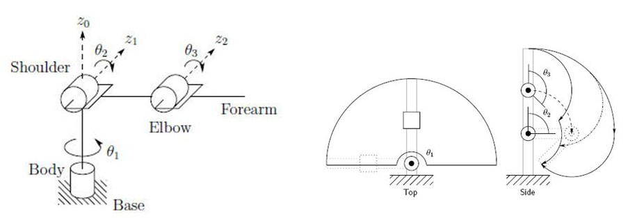
<br>
<sup><b>Fig. 3.1&nbsp;&nbsp;Geometry of a 3-DOF anthropomorphic robot</b></sup>
<br>
<sup>[Source: Narong Aphiratsakun. AIT]</sup>
</p>

The serial manipulator shown in figure 3.1  has n=3 joints: each a [revolute](https://en.wikipedia.org/wiki/Revolute_joint) with 1-DOF. Each joint connects with two links, making the total number of links, n+1 = 4, including the fixed base link.

Therefore, the total number of DOF for any serial manipulator with *three* 1-DOF joints is:

&nbsp;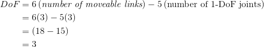

*Note:* The DOF of a serial manipulator with only [revolute](https://en.wikipedia.org/wiki/Revolute_joint) and/or [prismatic](https://en.wikipedia.org/wiki/Prismatic_joint) joints is *always* equal to the number of its joints, except when both ends of the manipulator are fixed (closed chain linkage).

##### Workspace
The *workspace* of a robotic manipulator is defined as the set of points that can be reached by its [end-effector](https://en.wikipedia.org/wiki/Robot_end_effector) <sup>[2]</sup>. In other words, it is simply the 3D space in which the robot mechanism works.

<p align="center">
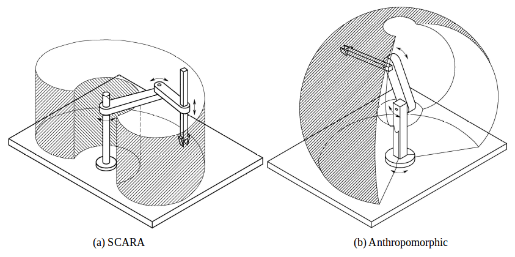
<br>
<sup><b>Fig. 3.2&nbsp;&nbsp;&nbsp;Workspaces of 3-DOF SCARA and anthropomorphic manipulators</b></sup>
<br>
<sup>[Source: Federica.EU]</sup>
</p>

Figure 3.2 shows two types of serial manipulators, [SCARA](https://en.wikipedia.org/wiki/SCARA) and [Anthropomorphic](https://en.wikipedia.org/wiki/SCARA) with their associated workspaces. Figure 3.1 also shows the workspace of the 3-DOF manipulator from a top and side perspective. 

It is important to note that no kinematic solution exists for the manipulator's configuration or joint space for any desired end-effector position outside of the workspace.

##### Spherical Wrist
A *spherical wrist* of a robotic manipulator is designed by arranging its last three revolute joints such that their axes of rotations intersect at a common point, referred to as the *wrist center*.

<p align="center">
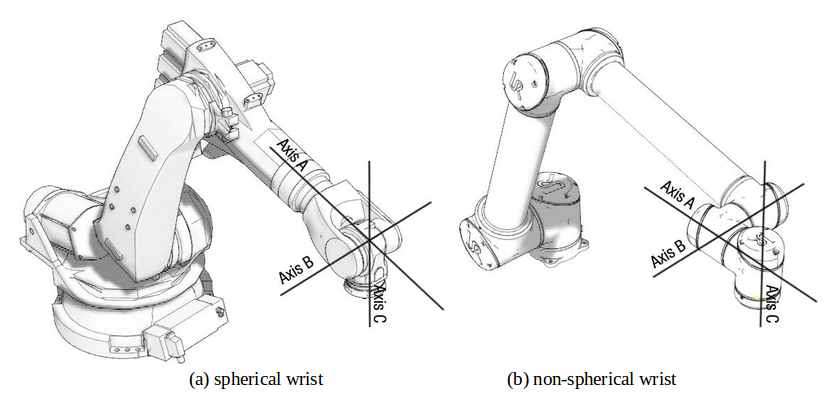
<br>
<sup><b>Fig. 3.3&nbsp;&nbsp;Difference between a spherical and non-spherical wrist</b></sup>
<br>
<sup>[Source: Khaled Elashry, ResearchGate]</sup>
</p>

Figure 3.3 shows the difference between a spherical and non-spherical wrist. In 3.3 (a), joint axes of rotations A, B, C all intersect at the wrist center, whereas, in 3.3(b), the wrist center is non-existent. Physically speaking, a six DOF serial manipulator like the one in figure 3.3 would use the first three joints to control the position of the wrist center while the last three joints (spherical wrist) would orient the end effector as needed, as in a human arm.

The spherical wrist is an important design characteristic in anthropomorphic manipulators which simplifies their kinematic analysis, as demonstrated in section 5. 

#### 3.2 Rotation of Coordinate Frames
Rotation matrices are a means of *expressing* a vector in one coordinate frame in terms of some other coordinate frame.

<p align="center">
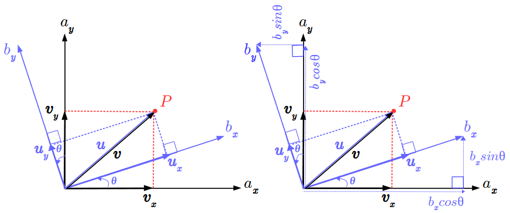
<br>
<sup><b>Fig. 3.4&nbsp;&nbsp;A 2D geometric rotation between coordinate frames A and B</b></sup>
<br>
</p>

In figure 3.2, Point **P** is expressed with vector **u** relative to coordinate *frame B*. The objective is to express point **P** with vector **v** relative to coordinate *frame A*. The basis vectors of **v**, **v<sub>x</sub>** and **v<sub>y</sub>** can be expressed in terms of the basis vectors of **u**, **u<sub>x</sub>** and **u<sub>y</sub>**  as follows:

<p align="center">
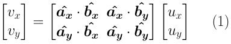
</p>

where unit vectors of *frame A*, **a<sub>x</sub>** and **a<sub>y</sub>** are expressed in terms of unit vectors of *frame B*, **b<sub>x</sub>** and **b<sub>y</sub>** as follows:

<p align="center">
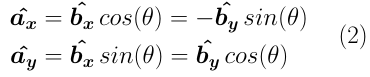
</p>

Substituting (2) in (1) and solving for the dot products yields the following equation:

<p align="center">

</p>

where the first term on the right-hand side is the **2D Rotation Matrix**, denoted in this case as **<i><sup>a</sup><sub>b</sub>R</i>**. Any point on coordinate *frame B* multiplied by <i><sup>a</sup><sub>b</sub>R</i> will project it onto *frame A*. In other words, to express a vector **u** on some *frame B* as a vector **v** on a different *frame A*, **u** is multiplied by the rotation matrix with angle theta by which *frame A* is rotated from *fram B*. Also worth noting is that the rotation from A to B is equal to the *transpose* of the rotation of B to A.


#### 3.3 Euler Angles
Euler angles are a system to describe a sequence or a composition of rotations. According to [Euler's Rotation Theorem](https://en.wikipedia.org/wiki/Euler%27s_rotation_theorem), the orientation of any [rigid body](https://en.wikipedia.org/wiki/Rigid_body) w.r.t. some fixed reference frame can always be described by **three** elementary rotations in a given **sequence** as shown in figure 3.3.

<p align="center">
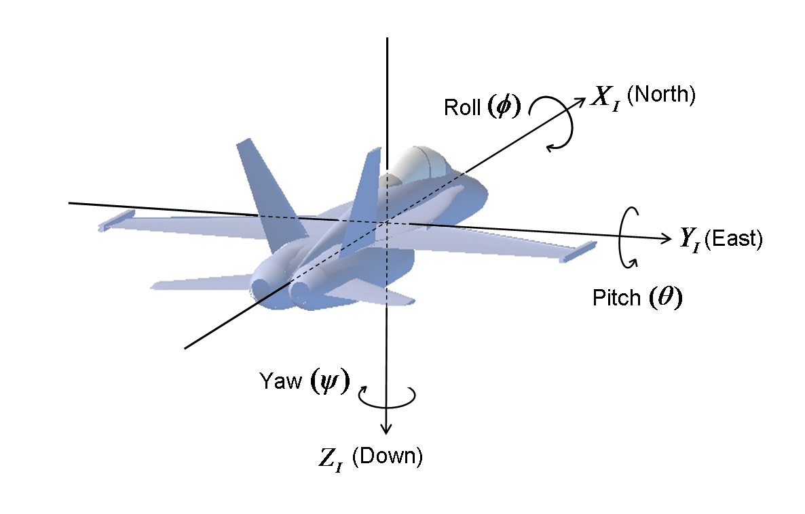
<br>
<sup><b>Fig. 3.5&nbsp;&nbsp;Defining Euler angles from a sequence of rotations</b></sup>
<br>
<sup>[Source: CHRobotics]</sup>
</p>

Conventionally, the movements about the three axes of rotations and their associated angles are described by the 3D rotation matrices in figure 3.4.

<p align="center">
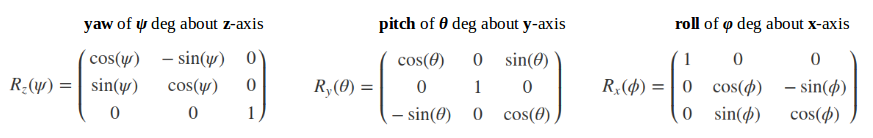
<br>
<sup><b>Fig. 3.6&nbsp;&nbsp;3D counter-clockwise rotation matrices describing yaw, pitch and roll</b></sup>
</p>

Euler angles are characterized by the following properties:

* Tait-Bryan vs. Classic
* Rotation Order
* Intrinsic (body fixed) vs. Extrinsic (fixed axes) rotations

**Intrinsic** or body-fixed rotations are performed about the coordinate system *as* rotated by the previous rotation. The rotation sequence changes the axis orientation after each elemental rotation while the body remains fixed.

<p align="center">
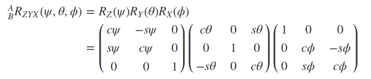
</p>

In an intrinsic sequence of rotations, such as, a Z-Y-X convention of a yaw, followed by a pitch, followed by a roll, subsequent elemental rotations are *post-multiplied*.

**Extrinsic** or fixed-axis rotations are performed about the *fixed* world reference frame. The original coordinate frame remains motionless while the body changes orientation.

<p align="center">
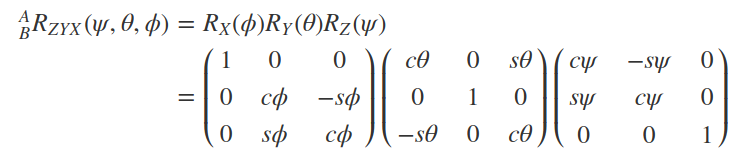
</p>

In an extrinsic sequence of rotations, such as, a Z-Y-X convention of a yaw, followed by a pitch, followed by a roll, subsequent elemental rotations are *pre-multiplied*.

**Note:** An extrinsic rotation sequence of A, B, C = an intrinsic rotation sequence of C, B, A.

Euler angles, normally in the [Tait–Bryan](https://commons.wikimedia.org/wiki/Tait-Bryan_angles), **Z-X-Y** convention, are also used in robotics for describing the degrees of freedom of a spherical wrist of a robotic manipulator.

Of particular importance is a phenomenon associated with Euler angles known as a [Gimbal Lock](https://en.wikipedia.org/wiki/Gimbal_lock) which occurs when there is a loss of one degree of freedom as a result of the axes of two of the three [gimbals](https://en.wikipedia.org/wiki/Gimbal) driven into a parrallel configuration.

#### 3.4 Homogeneous Transforms
In the case where a reference frame is both simultaneously rotated *and* translated (transformed) with respect to some other reference frame, a *homogeneous transform matrix* describes the transformation.

<p align="center">
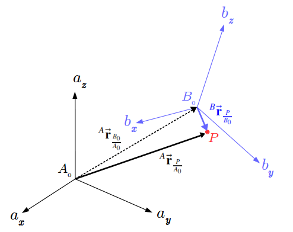
<br>
<sup><b>Fig. 3.7&nbsp;&nbsp;Rotation and Translation of frame B relative to frame A</b></sup>
<br>
<sup>[Source: Salman Hashmi. BSD License]</sup>
</p>

In figure 3.7, point P is expressed w.r.t. frame B and the objective is to express it w.r.t. frame A. To do so would require projecting or superimposing frame B onto frame A i.e. first rotating frame B to orient it with frame A and then translating it such that the centers B<sub>0</sub> and A<sub>0</sub> of both frames are aligned.

<p align="center">
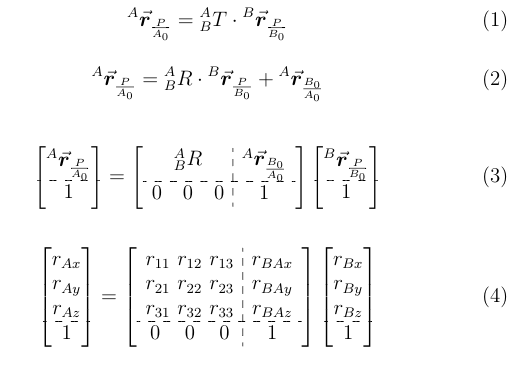
</p>

The relationship between the three vectors in figure 3.7 is shown in equation (1). The desired vector to point P from A<sub>0</sub> is the sum of the vector to point P from B<sub>0</sub>, rotated to frame A, and the translation vector to B<sub>0</sub> w.r.t A<sub>0</sub>. Equations (2) and (3) are the matrix-forms of equation (1) so that it can be rendered in software with linear algebra libraries.

<p align="center">
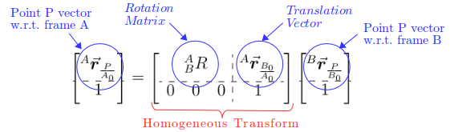
<br>
<sup><b>Fig. 3.8&nbsp;&nbsp;Anatomy of the homogeneous transform relationship</b></sup>
</p>

Figure 3.8 describes the components of equation (2). The desired vector to point P (w.r.t. to A<sub>0</sub>) is obtained by multiplying the given vector to point P (w.r.t. B<sub>0</sub>) by the *homogeneous transform* matrix, composed of the block Rotation matrix projecting B onto A and the block translation vector to B w.r.t A<sub>0</sub>.

<p align="center">
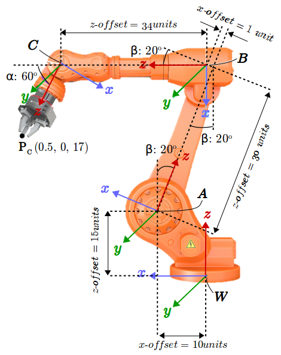
<br>
<sup><b>Fig. 3.9&nbsp;&nbsp;Transformation between adjacent revolute joint frames</b></sup>
</p>

As shown in figure 3.9, the position of the end-effector is known w.r.t. *its* coordinate reference frame *C*. The objective is to express it w.r.t. the *fixed* world coordinate reference frame *W*. This is because the positions of all objects of interest in the manipulator's environment are expressed w.r.t. the world reference frame. In other worlds, both, the end-effector, *and* the objects it interacts with need to be defined on the *same* coordinate reference frame. 

Point P relative to frame *W* can be found by successively applying equation (4) between adjacent joints:

<p align="center">
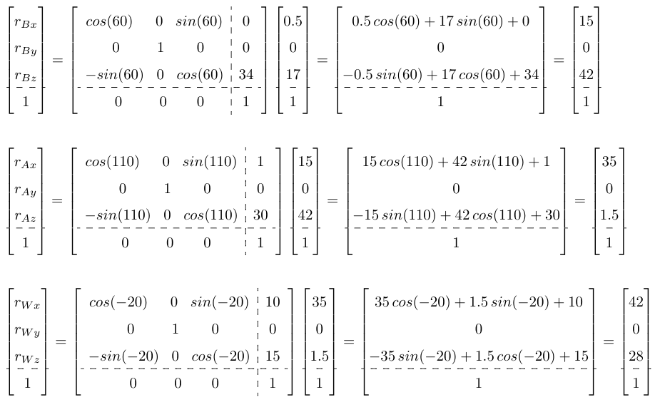
</p>

The above process can be summarized in terms of equation (1) with *<sup>W</sup><sub>C</sub>T* being the desired composite homogeneous transform that projects *frame C* onto *frame W*.

<p align="center">
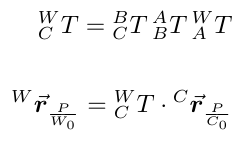
</p>

#### 3.5 Denavit–Hartenberg parameters
Before the homogeneous transforms between adjacent links can be computed, the coordinate frames of the joint links on which the transforms are applied must be defined. The [Denavit–Hartenberg (DH) parameters](https://en.wikipedia.org/wiki/Denavit%E2%80%93Hartenberg_parameters) are four parameters describing the rotations and translations between adjacent links. The definition of these parameters constitutes a convention for assigning coordinate reference frames to the links of a robotic manipulator. Figure 3.8 shows the so-called *modified* convention of DH parameters as defined by \[Craig, JJ. (2005)].

<p align="center">
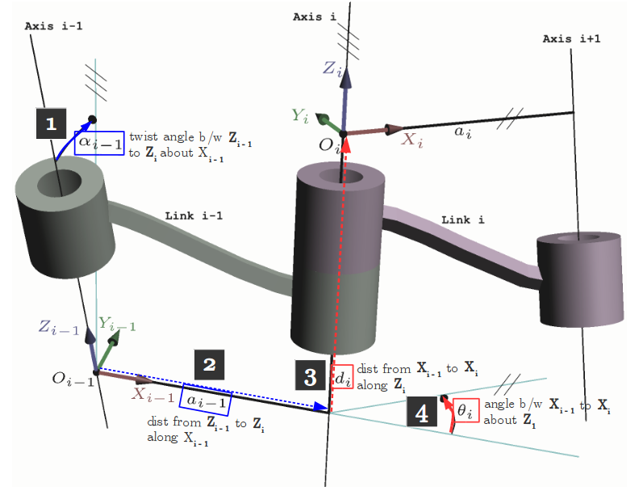
<br>
<sup><b>Fig. 3.8&nbsp;&nbsp;The four parameters of the Modified DH convention</b></sup>
<br>
<sup>[Source: Modified from Wikipedia Commons]</sup>
</p>

The parameters are defined as follows:

* α<sub>i-1</sub>: twist angle between the z-axes of links *i-1* and *i* (measured about *x<sub>i-1</sub>* in a right-hand sense)
* ɑ<sub>i-1</sub>: link distance between the z-axes of links *i-1* and *i*  (measured *x<sub>i-1</sub>*)
* d<sub>i</sub>: link offset signed distance between the x-axes of links  *i-1* and *i*  (measured along *z<sub>i</sub>*)
* θ<sub>i</sub>: joint angle between the x-axes of links  *i-1* and *i* (measured about *z<sub>i</sub>* in a right-hand sense)

Note:

* The origin of a frame *i* is defined by the intersection of *x<sub>i</sub>* and *z<sub>i</sub>*
* The x-axes define the common normals between *z<sub>i-1</sub>* and *z<sub>i</sub>*

Recall that to compute the position of the end-effector w.r.t. the base or world reference frame, transforms between adjacent links are composed as follows:

<p align="center">
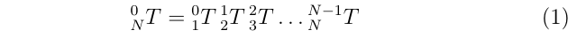
</p>

where the base frame is denoted by *0* and the end-effector's frame denoted by *N*. Thus,  <sup>0</sup><sub>N</sub>T defines the homogeneous transformation that projects frame *N* onto frame *0*. More specifically, a single transform between links *i-1* and *i* is given by

<p align="center">
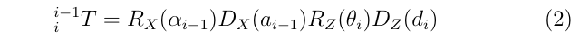
</p>

<p align="center">
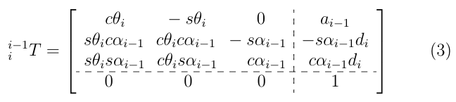
</p>

and is made up up of two rotations *R* of magnitudes α and θ, and two displacements *D* of magnitudes ɑ and d.

The parameter assignment process for open kinematic chains with n degrees of freedom (i.e., joints) is summarized as:

1. Label all joints from {1, 2, … , n}.
2. Label all links from {0, 1, …, n} starting with the fixed base link as 0.
3. Draw lines through all joints, defining the joint axes.
4. Assign the Z-axis of each frame to point along its joint axis.
5. Identify the common normal between each frame *Z*<sub>i-1</sub> and  *Z*<sub>i</sub>
6. The endpoints of *intermediate links* (i.e., not the base link or the end effector) are associated with two joint axes, {i} and {i+1}. For i from 1 to n-1, assign the *X*<sub>i</sub> to be ...
	1. For skew axes, along the normal between *Z*<sub>i</sub> and *Z*<sub>i+1</sub> and pointing from {i} to {i+1}.
	2. For intersecting axes, normal to the plane containing *Z*<sub>i</sub> and *Z*<sub>i+1</sub>.
	3. For parallel or coincident axes, the assignment is arbitrary; look for ways to make other DH parameters equal to zero.
7. For the base link, always choose frame {0} to be coincident with frame {1} when the first joint variable (θ<sub>1</sub> 
​​  or d<sub>1</sub>) is equal to zero. This will guarantee that α<sub>0</sub> = a<sub>0</sub> = 0, and, if joint 1 is a revolute, d<sub>1</sub> = 0. If joint 1 is prismatic, then θ<sub>1</sub> = 0.
8. For the end effector frame, if joint n is revolute, choose *X*<sub>n</sub> to be in the direction of *X*<sub>n−1</sub>
​​  when θ<sub>n</sub>​ = 0 and the origin of frame {n} such that d<sub>n</sub> = 0.

Special cases involving the *Z*<sub>i-1</sub> and *Z*<sub>i</sub> axes:

* collinear lines: alpha = 0 and a = 0
* parallel lines: alpha = 0 and a ≠ 0
* intersecting lines: alpha ≠ 0 and a = 0
* If the common normal intersects *Z*<sub>i</sub> at the origin of frame i, then d​<sub>i</sub> is zero.

Once the frame assignments are made, the DH parameters are typically presented in tabular form (below). Each row in the table corresponds to the homogeneous transform from frame {i} to frame {i+1}.

<p align="center">
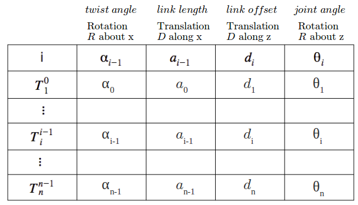
<br>
<sup><b>Table 3.1&nbsp;&nbsp;The four parameters of the Modified DH convention</b></sup>
</p>

#### 3.6 Forward and Inverse Kinematics
Forward Kinematics is the process of computing a manipulator's end-effector position in Cartesian coordinates from its given joint angles. This can be achieved by a composition of homogeneous transformations that map the base frame onto the end-effector's frame, taking as input the joint angles. The end-effector's coordinates can then be extracted from the resulting composite transform matrix.

The relationship between Forward and Inverse Kinematics is depicted in figure 3.9,

<p align="center">
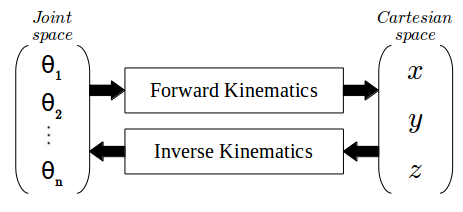
<br>
<sup><b>Fig. 3.9&nbsp;&nbsp;Relationship between Forward and Inverse Kinematics</b></sup>
</p>

Inverse Kinematics is the reverse process where the EE position is known and a set of joint angles that would result in that position need to be determined. This is a more complicated process than FK as multiple solutions can exist for the same EE position. However, no joint angle solutions exist for any EE position outside the manipulator's workspace. There are two main approaches to solve the IK problem: numerical and analytical. The later approach is used in this project.

<!--
#### 3.7 Robot Operating System (ROS)

##### ROS_MASTER:
* manager of the ROS *Nodes*
* allows _Nodes to locate one another and communicate
* also hosts the _Parameter_Server so running _Nodes can lookup parameter and configuration values e.g. wheel radius
* More Explanation:
* maintains a registry of all the active nodes on a system. It then allows these nodes to discover other nodes to establish lines of communications between nodes i.e. the nodes themselves don't have to communicate to other nodes through the ROS master; they can do it directly once the ROS master has allowed them to discover other relavant nodes for communication.

##### Communication between Nodes:
- Through _Topics or _Services
- Pub-Sub comm pattern vs, Req-Res comm pattern
- Pub-Sub comm pattern:
	- _Nodes can also share data (i.e. publish and subsrcribe _Messages) 
	  amongst themselves via nameds buses called _Topics. 
	  (Recall that the only stuff that nodes and ROS master share 
	  are Parameter values)
	- Nodes publish and subscribe _Messages over _Topics
- Req-Res comm architecture:
	- Like _Topics, _Services allow the passing of message 
	  betwee nodes

##### Environment Setup:
- Before we can launch and use a ROS package like turtlesim, 
  we must first ensure that all of the ROS environment variables 
  have been correctly set.
- Your ROS distro e.g. Kinetic provides a bash script called
  setup.bash to ensure this.
- This script can be run with the bash command: source
- Among other things, the ROS environment variables tell our 
  bash shell where ROS commands and packages can be found.

##### roscore
- rosout node is responsible for aggregating, filtering and
  recording log messages to a text file.

##### catkin
- a powerful build and package management system provided
  by ROS.
- a catkin workspace is a direcoty where catkin packages
  are built, modified and installed
- all ROS software components are organized into and 
  distributed as catkin packages
- catkin packages contain resources like source code for
  nodes, useful scripts, config file etc.

##### roslaunch
- Launch ROS Master and multiple nodes with one simple command
- Set default parameters on the parameter server
- Automatically re-spawn processes that have died
-->

------------

<a name="4.0"></a>
<!--<div style="text-align:left;">
  <span style="font-size: 1.4em; margin-top: 0.83em; margin-bottom: 0.83em; margin-left: 0; margin-right: 0; font-weight: bold;">4. Design Requirements</span><span style="float:right;"><a href="#top">Back to Top</a></span>
</div>-->
### 4. Design Requirements
The scope of the design is limited to a single pick-and-place cycle that consists of the following steps:

1. Movement of EE towards the target object
2. Grasping/picking the target object
3. Movement towards the drop-site
4. Dropping/placing the object at the drop-site

Figure 4.1 shows these steps in Gazebo.

<p align="center">

<br>
<sup><b>Fig 4.1&nbsp;&nbsp;A single pick-and-place cycle</b></sup>
<br>
<sup>[Source: Gazebo]</sup>
</p>

The primary metrics of interest are:

* Percentage of success in a total of 10 pick-and-place cycles
* Error in the calculated EE position trajectory (via FK) compared to the EE position received in the IK service request
* Time taken to execute a complete pick-and-place cycle

<p align="center">
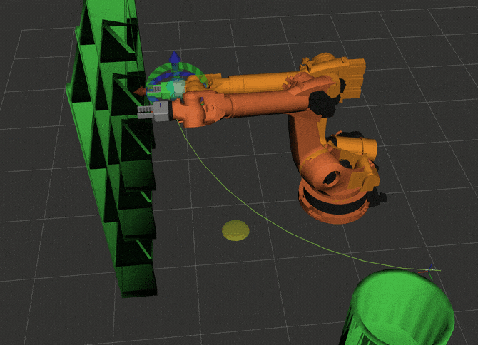
<br>
<sup><b>Fig 4.2&nbsp;&nbsp;Planned EE trajectory to drop-off location</b></sup>
<br>
<sup>[Source: RViz, MoveIt!]</sup>
</p>

Table 4.1 shows the criteria on which the project is evaluated,

<p align="center">

<br>
<sup><b>Table 4.1&nbsp;&nbsp;Project evaluation criteria</b></sup>
</p>

The minimum criteria is to achieve a success rate of at least *80%* with an EE trajectory error not greater than *0.5*.

------------

<a name="5.0"></a>
<!--<div style="text-align:left;">
  <span style="font-size: 1.4em; margin-top: 0.83em; margin-bottom: 0.83em; margin-left: 0; margin-right: 0; font-weight: bold;">5. Design Implementation</span><span style="float:right;"><a href="#top">Back to Top</a></span>
</div>-->
### 5. Design Implementation
In order to perform a single pick-and-place operation, joint angles corresponding to the given locations of the target object and drop-off site need to be determined. Towards this goal, an Inverse Kinematic analysis is performed and implemented in software using ROS and Python.

#### 5.1 Kinematic Analysis

##### DH Parameters
Figure 5.1 (a) shows the Kuka KR210 serial manipulator and (b) shows its *zero configuration* schematic indicating its DH parameters. In the *zero configuration*, all joint angles are assumed to be zero.

<p align="center">
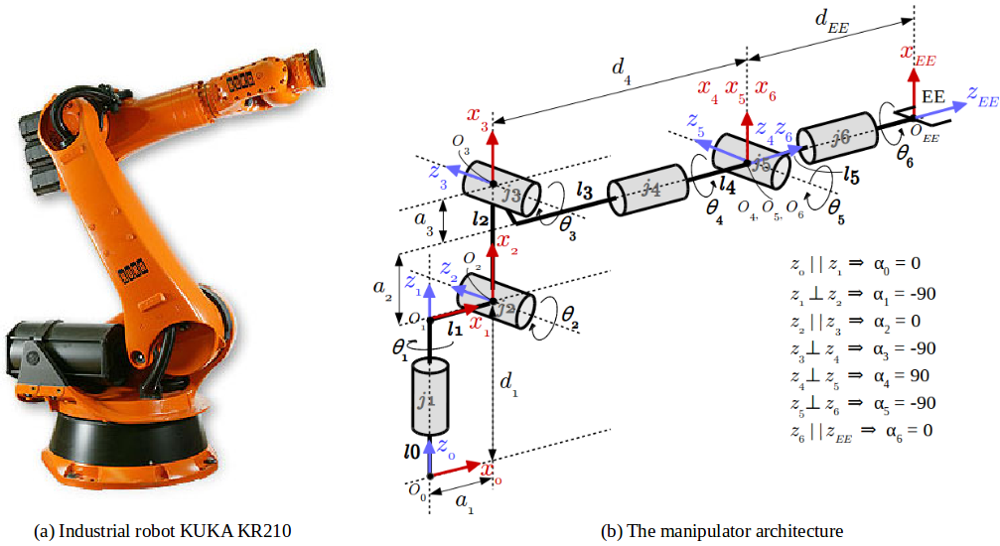
<br>
<sup><b>Fig. 5.1&nbsp;&nbsp;The KUKA KR210 6-DOF robotic manipulator and its schematic architecture</b></sup>
<br>
<sup>[Source: (a) KUKA Roboter GmbH, (b) Salman Hashmi, BSD License]</sup>
</p>

Note that, for joint 2, there is a constant -90 degree offset between x<sub>1</sub> and x<sub>2</sub>.

The following steps are performed to construct the KR210 schematic and derive its DH Table:

1. Label joints from 1 to n = 6
2. Label each link from 0 to n = 6
3. Define z-axes as the joint axes (joints 2, 3, and 5 are all parallel while joints 4 and 6 are coincident)
4. Define x-axes as the common normals
5. Define reference frame origins for each joint
6. Define the x-axes as the common normals between z<sub>i-1</sub> and z<sub>i</sub>
7. Define the origin of frame {i} as the intersection of x<sub>i</sub> with z<sub>i</sub>
8. Add a fixed frame rigidly attached to link 6 for the gripper or EE (Note: the EE reference frame O<sub>EE</sub> differs from the link 6 reference frame of O<sub>4</sub>, O<sub>5</sub>, O<sub>6</sub> only by a translation along z<sub>6</sub>)
9. Label all non-zero DH parameters

The last step is implemented using table 5.1 which is constructed from the KR210 URDF file, `kr210.urdf.xacro`.

<p align="center">

<br>
<sup><b>Table 5.1&nbsp;&nbsp;Location of joint {i} relative to its parent joint {i-1}  from the KR210 URDF file</b></sup>
</p>

Note the following concerning the URDF file and table 5.1,

* RViz does not directly show joint reference frames but instead shows link reference frames
* In th URDF file, each joint is defined relative to the center (not origin) of its parent joint e.g. row 2 shows the location of joint 2 relative to the center (not origin) of joint 1
* The base_link in Table 5.1 is depicted as link0 (l0) in figure 5.1 (b)

The DH Table is then derived from figure 5.1 (b) and table 5.1,

<p align="center">
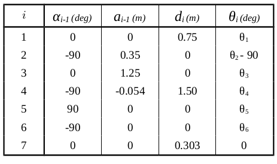
<br>
<sup><b>Table 5.2&nbsp;&nbsp;Modified DH Table of the KR210</b></sup>
</p>

##### Inverse Kinematic Solution Approach
An *analytical* or *closed-form* approach is used to perform inverse kinematics. This approach has two advantages:

1. Much faster to solve compare to a numerical approach
2. Easier to develop rules for which solution is appropriate

Additionally, The type of robotic manipulator used (anthropomorphic) meets the conditions for applicability of this approach:

1. Axes of rotations of 3 adjacent joints should intersect at a single point (satisfied by a spherical wrist design)
2. Axes of rotations of 3 adjacent joints are parallel (special case of 1. since parallel lines intersect at infinity)

The *4 x 4* homogeneous transform between adjacent links from section 3 is shown here again for clarity:
 
<p align="center">
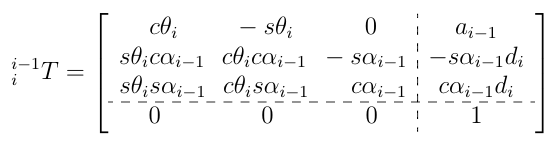
</p>

<!--t is noted that for a 6-joint manipulator, 6 multiples of the homogeneous transform are invloved in the overall transformation between the base and the end-effector, and 12 simulatenous nonlinear equaitons would have to solved for each transform multiple.

It is noted that 12 simulatenous nonlinear equaitons (from first 3 rows) would have to solved for a single transform between adjacent links for a total of 6 transofrm multiples corresponding to a 6-joint manipulator for the overall transformation between the base link and the end-effector.-->

It is noted that 12 simultaneous nonlinear equations would have to be solved, one for each term in the first 3 rows of the overall homogeneous transformation between the base link and the end-effector. Therefore, to simplify the solution, The spherical wrist design is exploited to kinematically *decouple* the *position* and *orientation* of the end-effector such that the original problem is reduced to two simpler problems that can be solved independently:

1. Find position (Cartesian coordinates) of WC and geometrically compute joint angles 1, 2, 3 that physically control it
2. Find the composition of x-y-z rotations (r, p, y) that orients EE and analytically solve its Euler angles: joint angles 4, 5, 6

<!--
* position&nbsp;&nbsp;&nbsp;&nbsp;&nbsp;&nbsp;&nbsp;&nbsp; - cartesian coordinates of WC
&nbsp;&nbsp;&nbsp;&nbsp;&nbsp;&nbsp;&nbsp;&nbsp;&nbsp;&nbsp;&nbsp;&nbsp;&nbsp;&nbsp;&nbsp;&nbsp;&nbsp;&nbsp;&nbsp;&nbsp;&nbsp;&nbsp; - Joints 1, 2, 3 control position of WC in a 6-DOF serial manipulator

* orientation&nbsp;&nbsp; - composition of rotations (pitch, roll, yaw) to orient the end-effector
&nbsp;&nbsp;&nbsp;&nbsp;&nbsp;&nbsp;&nbsp;&nbsp;&nbsp;&nbsp;&nbsp;&nbsp;&nbsp;&nbsp;&nbsp;&nbsp;&nbsp;&nbsp;&nbsp;&nbsp;&nbsp;&nbsp; - Joints 4, 5, 6 orient the end-effector as needed
-->

##### Inverse Position Kinematics
As mentioned previously, joints 1, 2, and 3, control the position of the *spherical wrist* consisting of joints 4, 5, and 6. In the *position* part of Inverse Kinematics, joint angles 1, 2, and 3 are geometrically calculated from the position of the spherical wrist center (WC). This position is determined from the end-effector position (EE) using figure 5.2.

<p align="center">
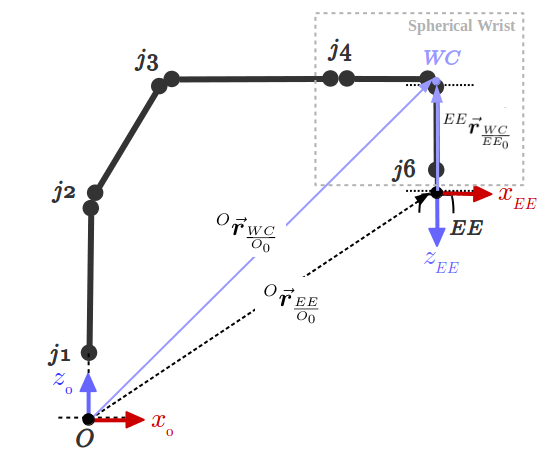
<br>
<sup><b>Fig. 5.2&nbsp;&nbsp;Finding location of WC relative to base frame <i>O</i></b></sup>
</p>

The position vector of WC w.r.t. to EE (**r**<sub>WC/EE<sub>O</sub></sub>) is a simple translation along z<sub>EE</sub>. The desired position vector of WC w.r.t. the base frame O can be found by transforming **r**<sub>WC/EE<sub>O</sub></sub> onto the base frame O using a homogeneous transform consisting of Rotation matrix <sup>0</sup><sub>EE</sub>R and a translation vector from O to EE,

<p align="center">
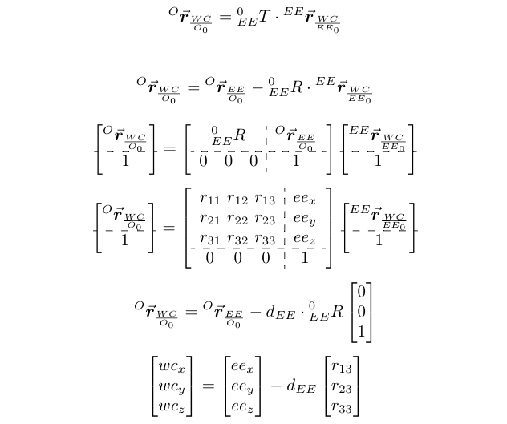
</p>

where d<sub>EE</sub> is given by d<sub>7</sub> in the DH Table 5.2, and the column 3 vector of the Rotation Matrix describes the z-axis of EE relative to base frame O.

Once the Cartesian coordinates of WC are known, θ<sub>1</sub> and θ<sub>2</sub> can be calculated using the [Law of Cosines](https://en.wikipedia.org/wiki/Law_of_cosines) on an [SSS](https://www.mathsisfun.com/algebra/trig-solving-sss-triangles.html) triangle with edges at joints 2, 3 and 5, as shown in figure 5.3.

<p align="center">

<br>
<sup><b>Fig. 5.3&nbsp;&nbsp;Calculation of θ<sub>1</sub> and θ<sub>2</sub> using an SSS triangle</b></sup>
</p>

*Note:* Joint angles are defined as rotations about z between adjacent x axes, e.g. joint angle θ<sub>3</sub> is the angle between x<sub>2</sub> and x<sub>3</sub> about z<sub>3</sub> (not shown).

θ<sub>1</sub> is the joint-1 angle between x<sub>0</sub> and x<sub>1</sub> measured about z<sub>1</sub>. It is calculated using the x and y coordinates of WC relative to the base frame,

<p align="center">
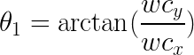
</p>

θ<sub>2</sub> is the joint-2 angle between x<sub>1</sub> and x<sub>2</sub> measured about z<sub>2</sub>. Note that, for joint 2, there is a constant -90 degree offset between x<sub>1</sub> and x<sub>2</sub> as shown in figure 5.1 (b) and in DH Table 5.2 for i = 2,

<p align="center">
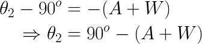
</p>

where W is given by,

<p align="center">
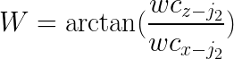
</p>

and A is determined by the Law of Cosines.

θ<sub>3</sub> is the joint-3 angle between x<sub>2</sub> and x<sub>3</sub> measured about z<sub>3</sub>. Figure 5.4 (b) is used to calculate θ<sub>3</sub> where 5.4 (a) is used as a comparison to help visualize the sag in the links between joints 3 and 5.

<p align="center">
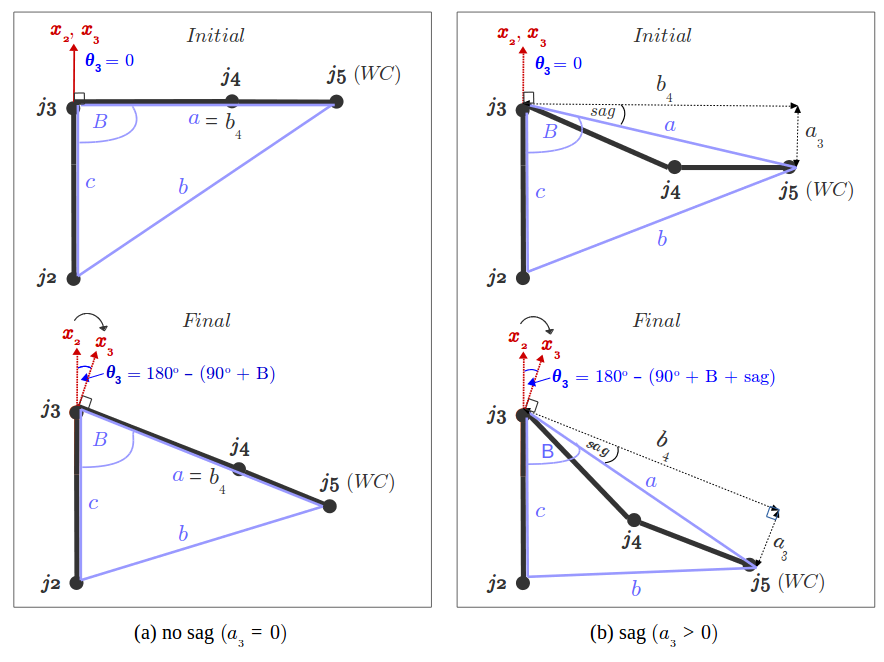
<br>
<sup><b>Fig. 5.4&nbsp;&nbsp;Calculation of θ<sub>3</sub> and accounting for sag in the links between j3 and j5</b></sup>
</p>

As described in figure 5.4 (b) *Final*, θ<sub>3</sub> is given by,

<p align="center">
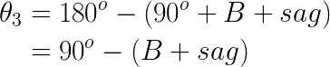
</p>

where the sag angle is,

<p align="center">
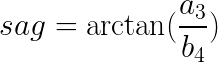
</p>

and B is determined by the Law of Cosines.

##### Inverse Orientation Kinematics
Recall that joints 4, 5, and 6 constitute the spherical wrist design, where joint 5 is the wrist center (WC). In the *orientation* part of Inverse Kinematics, joint angles 4, 5, and 6 are analytically calculated from <sup>3</sup><sub>6</sub>R; the composition of x-y-z rotations (roll, pitch, yaw) that orients the WC. Thus, joint angles 4, 5, and 6 are the Euler angles of this composition of rotations.

<sup>3</sup><sub>6</sub>R can be determined from <sup>0</sup><sub>6</sub>R as follows,

<p align="center">
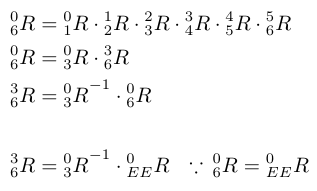
</p>

where <sup>i-1</sup><sub>i</sub>R is the composite rotation matrix from the homogeneous transform <sup>i-1</sup><sub>i</sub>T,

<p align="center">
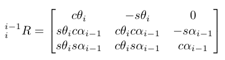
</p>

and <sup>0</sup><sub>3</sub>R is given by,

<p align="center">
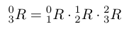
</p>

and since joint angles θ<sub>1</sub>, θ<sub>2</sub>, and θ<sub>3</sub> have already been calculated, <sup>0</sup><sub>3</sub>R is no longer a variable as θ<sub>1</sub>, θ<sub>2</sub>, and θ<sub>3</sub> can simply be substituted in <sup>0</sup><sub>1</sub>R, <sup>1</sup><sub>2</sub>R, and <sup>2</sup><sub>3</sub>R respectively, leaving θ<sub>4</sub>, θ<sub>5</sub>, and θ<sub>6</sub> as the only variables in <sup>3</sup><sub>6</sub>R. 

Symbolically evaluating <sup>3</sup><sub>6</sub>R in sympy yields,

<p align="center">
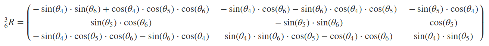
</p>

Joint angles, θ<sub>4</sub>, θ<sub>5</sub>, and θ<sub>6</sub> can then be analytically determined from <sup>3</sup><sub>6</sub>R,

<p align="center">
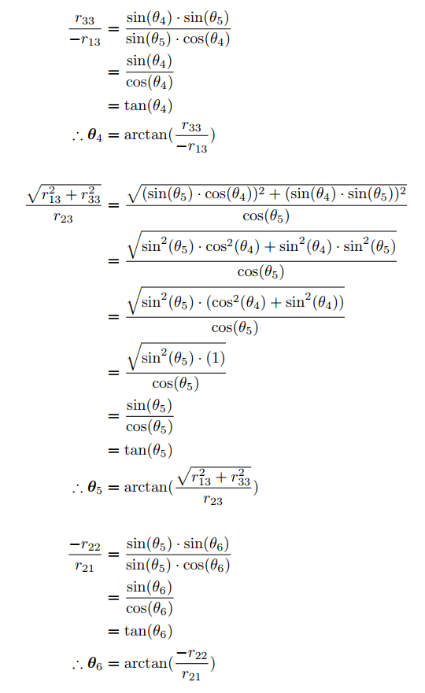
</p>

#### 5.2 Software Implementation
The primary code for the project is in the [ROS node](http://wiki.ros.org/ROS/Tutorials/UnderstandingNodes), `IK_server` in the `kuka_arm` [ROS package](http://wiki.ros.org/Packages), and the KR210 is operated in a ROS based simulator environment consisting of [Gazebo](http://gazebosim.org/), [RViz](http://wiki.ros.org/rviz) and [MoveIt!](http://moveit.ros.org/).

The `IK_server` node receives end-effector (gripper) poses from the KR210 simulator and performs
Inverse Kinematics, providing a response to the simulator with calculated joint variable values (joint angles in this case). The IK analysis conducted in section 5.1 is implemented in the `IK_server` node using [Sympy](http://www.sympy.org/en/index.html) and [Numpy](http://www.numpy.org/) libraries.

The following are selected notes of interest regarding this implementation:

* All python code conforms to [PEP 8](https://www.python.org/dev/peps/pep-0008/) wherever possible with occasional deviations to accommodate Sympy and Numpy matrix notations, and where it improves readability. Similarly, function docstrings are conformed to [PEP 257](https://www.python.org/dev/peps/pep-0257/) convention.

* The DH table for the KR210 is constructed from the `kr210.urdf.xacro` file in the `kuka_arm` ROS package.

* The gripper or EE orientations are converted to the desired [Euler angles](https://en.wikipedia.org/wiki/Euler_angles) from the [quaternions](https://en.wikipedia.org/wiki/Quaternion) received in the IK [service](http://wiki.ros.org/Services) request using ROS [geometry transformations module](https://github.com/ros/geometry/blob/indigo-devel/tf/src/tf/transformations.py#L1089).

* URDF vs DH frame misalignment in gripper/EE pose is addressed by aligning the URDF and DH EE frames through a sequence of intrinsic rotations: 180 deg yaw and -90 deg pitch.

* In the Sympy implementation, the DH Table is substituted in individual transforms *before* composing the overall homogeneous transform between the base frame and the end-effector. This is because it takes considerable calculation time (in the order of several seconds) to symbolically simplify the product of six 4x4 transform matrices each consisting of trigonometric expressions. By substituting some of the values for constants and angles in these trigonometric expressions for each individual matrix, the overall composite homogeneous transform matrix is simplified much faster (down to the order of milliseconds).

* As described in figures 5.3 and 5.4, to account for sag in side_a of the SSS triangle (the line segment connecting joints 3 and 5 (WC)) caused by joint 4, first, length of side_a is recalculated, and second, the sag angle formed between y3-axis and side_a is calculated and accounted for in the calculation of `theta_3`.

* Once the composite Rotation matrix, `R3_6`, is symbolically evaluated using Sympy for calculating thetas 1, 2, 3, the `IK_server` node is reimplemented in Numpy to optimize speed:

	* mpmath matrix and trig imports are replaced with numpy
	* dh params (dict keys) are redefined as strings instead of sympy symbols
	* `q` symbols are replaced with `thetas` to make joint variables consistent
	* dh params are moved from global scope since joint variables are not immutable like sympy symbols
	* sympy matrices are replaced with numpy matrices
	* dh variable is added to function args and accessed with string keys
	* `R0_3` is converted to a float array before passing in `numpy.lingalg.inv` to compute inverse
	* Remove single and composite transforms (required for fk only)
	* joint angles are updated in dh params dictionary after they are calculated
	* To improve accuracy of theta 2 and 3, both the length of side_a (containing sag) and the sag angle are rounded-off to a high and consistent number of digits

------------

<a name="6.0"></a>
<!--<div style="text-align:left;">
<span style="font-size: 1.4em; margin-top: 0.83em; margin-bottom: 0.83em; margin-left: 0; margin-right: 0; font-weight: bold;"> 6. Testing  and Review</span><span style="float:right;"><a href="#top">Back to Top</a></span>
</div>-->
### 6. Testing and Review
##### Testing
After implementing the `IK_server` ROS node, the pick-and-place operation can be tested by launching the project in **test** mode by setting the *demo* flag to *"false"* in `inverse_kinematics.launch` file under `/pick-and-place/kuka_arm/launch/`.

In addition, the spawn location of the target object can be modified if desired. To do this, modify the **spawn_location** argument in `target_description.launch`under `/pick-and-place/kuka_arm/launch/` where 0-9 are valid values for spawn_location with 0 being random mode.

The project is launched by calling the `safe_spawner` shell script in a fresh terminal

```sh
$ cd ~/catkin_ws/src/pick-place-robot/kuka_arm/scripts
$ ./safe_spawner.sh
```

**Note:** If Gazebo and RViz do not launch within a couple of seconds, close all processes started by this shell script by entering `Ctrl+C` in each of the sprung up terminals. Then rerun the safe_spawner script.

Once Gazebo and RViz are up and running, and the following can be seen in the gazebo world:

* Robot
* Shelf
* Blue cylindrical target in one of the shelves
* Dropbox right next to the robot

The `IK_server` ROS node is run from a new terminal window as follows 

```sh
$ cd ~/catkin_ws/src/pick-place-robot/kuka_arm/scripts
$ rosrun kuka_arm IK_server.py
```
	
With Gazebo and RViz windows arranged side-by-side, the **Next** button on left side of RViz window can be clicked to proceed from one state to another, while the **Continue** button can be clicked to continuously run a complete pick-and-place cycle. 

**Warning:** The terminal window from which the `safe_spawner` shell script is called needs to be monitored for a `Failed to call service calculate_ik` error, in which case, all running processes need to be killed and the `safe_spawner` script called again.

As shown in figure 6.1, the status message in RViz changes as the different stages of pick-and-place simulation are traversed. Actuation is observed in the Gazebo window.

<p align="center">
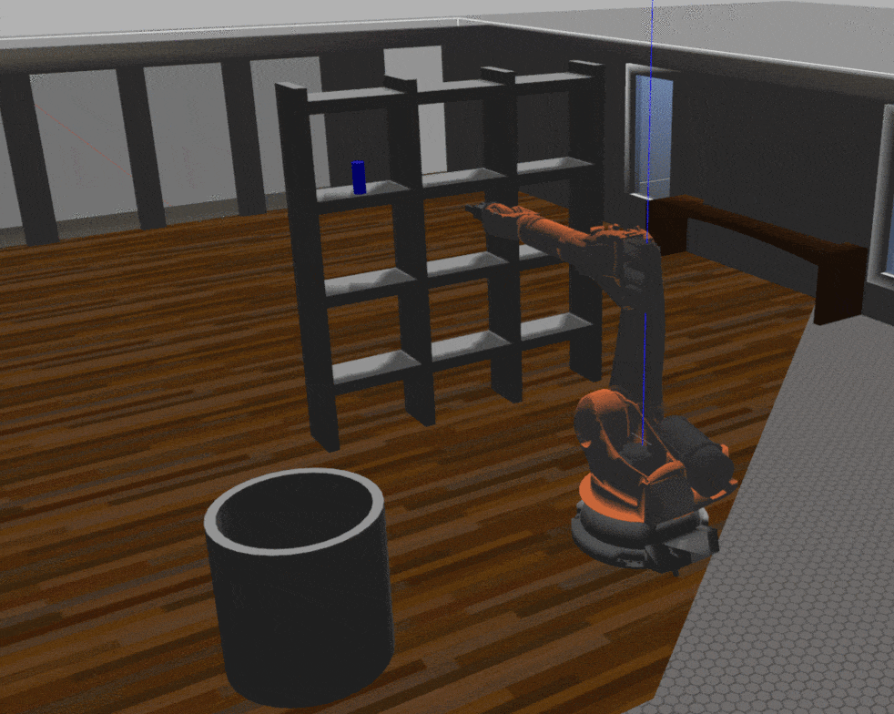
<br>
<sup><b>Fig. 6.1&nbsp;&nbsp;Steps followed in a single pick-and-place cycle</b></sup>
<br>
<sup>[Source: Gazebo, MoveIt!]</sup>
</p>

##### Review
The primary metric of interest is the error in the calculated EE trajectories. Since multiple joint angle values can lead to the same EE position, error in joint angle values is not a reliable indicator of whether the EE position is being calculated correctly. The only way to know conclusively is to substitute the joint angle values from IK into FK and compare the resulting EE position to the one received in the IK service request.

As defined in section 4, the three evaluation metrics are:

* *Success Rate*: &nbsp;&nbsp; Percentage of success in a total of 10 pick-and-place cycles (success defined in Table 4.1)
* *EE Error*: &nbsp;&nbsp;&nbsp;&nbsp;&nbsp;&nbsp;&nbsp;&nbsp;&nbsp;&nbsp; Error in the calculated EE position trajectory (via FK) compared to the one received in IK request
* *Time Taken*: &nbsp;&nbsp;&nbsp;&nbsp;&nbsp; Average time taken for a total of 10 pick-and-place cycles
 

Figure 6.2 shows the KR210 execute a planned EE trajectory to the drop-off location with joint angles obtained from the IK implementation.

<p align="center">
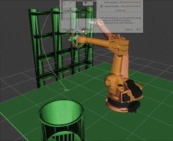
<br>
<sup><b>Fig. 6.2&nbsp;&nbsp;Executing a planned EE trajectory</b></sup>
<br>
<sup>[Source: MoveIt!]</sup>
</p>

A cursory visual inspection of the animation in figure 6.2 shows that the trajectory of received EE positions in the IK service request is being correctly followed by the six joints of the KR210. The same is observed in Figure 6.3 which comprehensively compares various *requested* EE trajectories with the *followed* EE trajectories and shows the overall EE position error for each. 

<p align="center">

<br>
<br>
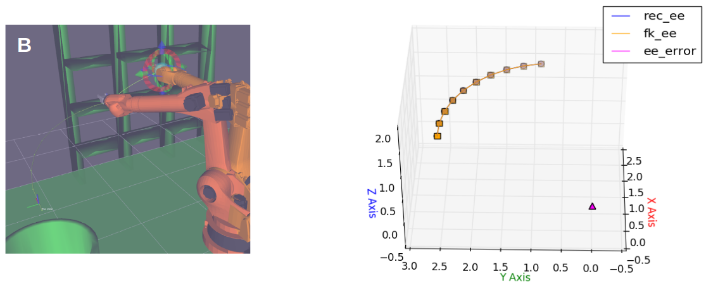
<br>
<br>
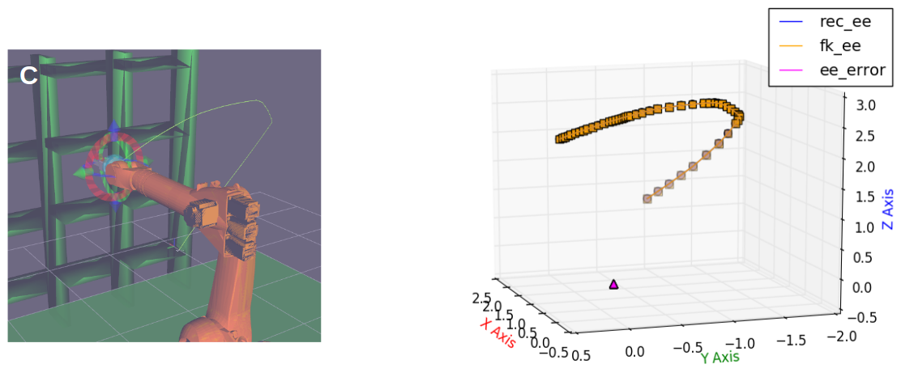
<br>
<br>
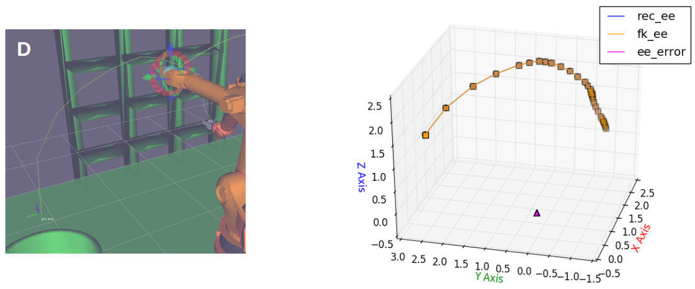
<br>
<br>
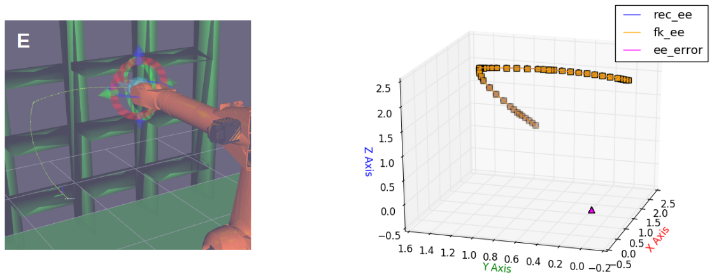
<br>
<br>
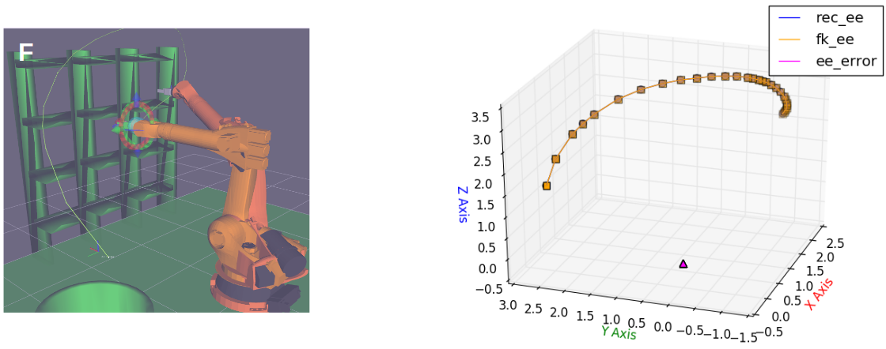
<br>
<br>
<sup>(a) Received EE positions in IK request&nbsp;&nbsp;&nbsp;&nbsp;&nbsp;&nbsp;&nbsp;&nbsp;&nbsp;&nbsp;&nbsp;&nbsp;&nbsp;&nbsp;&nbsp;&nbsp;&nbsp;&nbsp;&nbsp;&nbsp;&nbsp;&nbsp;&nbsp;&nbsp;&nbsp;&nbsp;&nbsp;&nbsp;&nbsp;&nbsp;&nbsp;&nbsp;&nbsp;&nbsp;&nbsp;&nbsp;&nbsp;&nbsp;&nbsp;&nbsp;&nbsp;&nbsp;&nbsp;&nbsp;&nbsp;(b) Comparison of received and fk EE positions&nbsp;&nbsp;&nbsp;&nbsp;&nbsp;&nbsp;&nbsp;&nbsp;&nbsp;&nbsp;&nbsp;</sup>
<br>
<br>
<sup><b>Fig. 6.3&nbsp;&nbsp;Visualizing planned EE trajectories and associated error</b></sup>
</p>

Figure 6.3 (a) shows six EE position trajectories received by the `IK_server` ROS node in the IK service request; A, C, and E to the target object (not visible) and B, E, and F to the drop-off location. Figure 6.3 (b) compares these received EE positions (*rec_ee* in blue) to the ones obtained by FK (*fk_ee* in orange) from the six joint angles. Due to a very low resulting EE overall offset error (*ee_error* in magenta), the blue plot points of the received EE positions are hidden behind the orange plot points of the EE positions obtained from FK. A visual inspection also shows 

##### Results
After a total of 10 runs in the simulator, the following results are achieved:

* *Success Rate*: &nbsp;&nbsp;&nbsp;&nbsp;&nbsp; 100%
* *EE Error*: &nbsp;&nbsp;&nbsp;&nbsp;&nbsp;&nbsp;&nbsp;&nbsp;&nbsp;&nbsp;&nbsp;&nbsp;&nbsp; 0.00000006
* *Average Time*: &nbsp;&nbsp;&nbsp;&nbsp; 51 sec

##### Improvements
In addition to the accuracy improvements made in the calculation of *theta2* and *theta3* in section 5.1, as well as a 350x time improvement with a Numpy implementation of the IK_server node, the following can offer further improvements in EE error and speeds,

* Ensuring precision of intermediate calculation results when solving for joint angles
* Use of quaternions instead of Euler angles
* Solving the SSS triangle with a slightly faster Law of Cosines alternative:
	1. Using The Law of Cosines to calculate the largest angle
	2. Using The Law of Sines to find another angle
	3. Using angles of a triangle add to 180° to find the last angle.

------------
### References

1. Narong Aphiratsakun. (2015). MT411 Robotic Engineering, *Asian Institute of Technology (AIT)*. http://slideplayer.com/slide/10377412/

2. Siciliano et al. (2010). Robotics: Modelling, Planning and Control, (*Springer*)

3. Elashry, Khaled & Glynn, Ruairi. (2014). An Approach to Automated Construction Using Adaptive Programing. 51-66. 10.1007/978-3-319-04663-1_4, (*Springer*)

4. Yi Cao, Ke Lu, Xiujuan Li and Yi Zang (2011). Accurate Numerical Methods for Computing 2D and 3D Robot Workspace [Journal] // International Journal of Advanced Robotic Systems : INTECH, August 2011. – 6 : Vol. VIII – pp. 1-13.

5. Understanding Euler Angles. CHRobotics. http://www.chrobotics.com/library/understanding-euler-angles

6. Craig, JJ. (2005). Introduction to Robotics: Mechanics and Control, 3rd Ed (*Pearson Education*)

------------

> Copyright © 2017, Salman Hashmi. See attached license.

